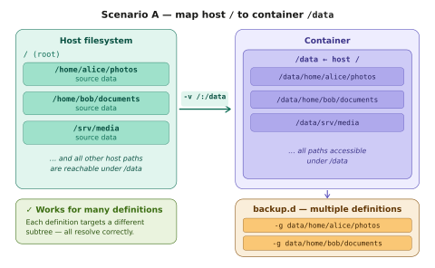
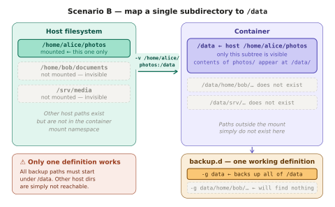

# dar-backup Docker: Volume Mounts and Backup Definitions

This document explains how host directory mounts into a `dar-backup` container interact with
backup definitions — and why the choice of mount point determines how many definitions you
can use simultaneously.

---

## The core concept

Inside the container, `dar-backup` always operates under `/data`.  
Your backup definitions use paths **relative to `/data`**, for example:

```text
-R /
-g data/home/alice/photos
```

The `-R /` sets the working root to `/` inside the container, and `-g data/home/alice/photos`
selects a subtree under it — which is actually `/data/home/alice/photos` inside the container.

What lives at `/data` depends entirely on the `-v` mount you pass to `docker run`.

---

## Scenario A — Map host `/` to container `/data`

```bash
docker run --rm \
  -e RUN_AS_UID=$(id -u) \
  -v /:/data \
  -v "$BACKUP_DIR":/backups \
  -v "$RESTORE_DIR":/restore \
  -v "$BACKUP_D_DIR":/backup.d \
  "$IMAGE" -F --log-stdout
```

[](scenario-a-root-mount-large.png)

**What happens:** The entire host filesystem appears inside the container rooted at `/data`.
Every host path `/foo/bar` is reachable as `/data/foo/bar`.

**Consequence for backup definitions:** You can have as many definitions as you like,
each targeting a completely different area of the host:

```text
# definition: photos-backup
-R /
-g data/home/alice/photos

# definition: documents-backup
-R /
-g data/home/bob/documents

# definition: media-backup
-R /
-g data/srv/media
```

All three resolve correctly because the full host tree is visible under `/data`.

**When to use this:** You want a single container invocation (or a `backup.d` directory
with multiple definitions) to back up several unrelated locations on the host.

> **Note on security:** Mounting `/` gives the container read access to the entire host
> filesystem. Run with `--read-only` on the data volume and a non-root `RUN_AS_UID` to
> limit the blast radius.

---

## Scenario B — Map a single subdirectory to container `/data`

```bash
docker run --rm \
  -e RUN_AS_UID=$(id -u) \
  -v /home/alice/photos:/data \
  -v "$BACKUP_DIR":/backups \
  -v "$RESTORE_DIR":/restore \
  -v "$BACKUP_D_DIR":/backup.d \
  "$IMAGE" -F --log-stdout
```

[](scenario-b-subdir-mount-large.png)

**What happens:** Only `/home/alice/photos` from the host is mounted. Inside the container,
`/data` *is* that directory — its contents appear directly at `/data/`. No other host paths
exist inside the container.

**Consequence for backup definitions:** Only one definition shape works:

```text
# definition: photos-backup  ✓ works
-R /
-g data

# definition: documents-backup  ✗ will find nothing
-R /
-g data/home/bob/documents    # this path does not exist in the container
```

**When to use this:** You have a single, well-scoped directory to back up, and you prefer
the principle of least privilege — the container can only ever see that one directory.

---

## Choosing the right approach

| | Scenario A (`-v /:/data`) | Scenario B (`-v /path/to/dir:/data`) |
|---|---|---|
| Paths visible in container | All host paths under `/data/…` | Only the mounted dir's contents |
| Backup definitions | Many, targeting different subtrees | One (or all targeting the same root) |
| Host exposure | Entire filesystem (read) | Single directory only |
| Typical use | Multi-source backup jobs | Single-purpose, least-privilege |

The practical rule: **the more host directories you need to back up with separate definitions,
the higher up the host tree your mount point must be.** Mapping `/` is the most flexible;
mapping a leaf directory is the most restrictive.

---

## Quick reference

```bash
# Scenario A — full host tree visible
-v /:/data

# Scenario B — single directory
-v /home/alice/photos:/data
-v /srv/media:/data          # only one -v per /data target

# Multiple separate mounts are not directly supported for /data
# Use Scenario A if you need multiple sources in one run
```

---

*Diagrams:*
- [`scenario-a-root-mount.svg`](scenario-a-root-mount.svg) — editable master, Scenario A
- [`scenario-b-subdir-mount.svg`](scenario-b-subdir-mount.svg) — editable master, Scenario B
