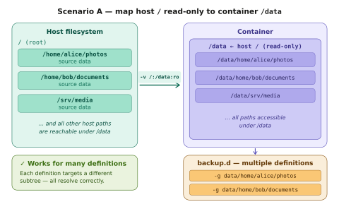
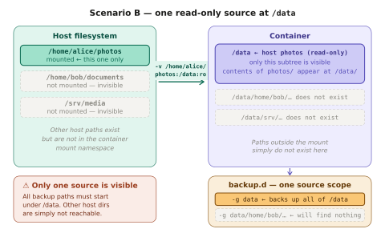

<!--
SPDX-FileCopyrightText: 2025-2026 Per Jensen

SPDX-License-Identifier: GPL-3.0-or-later

This file is part of dar-backup-image:
https://github.com/per2jensen/dar-backup-image

License terms and warranty disclaimer:
https://github.com/per2jensen/dar-backup-image/blob/main/LICENSE
-->

# dar-backup Docker: Volume Mounts and Backup Definitions

This document explains how host directory mounts into a `dar-backup` container interact with
backup definitions — and why the choice of mount point determines how many definitions you
can use simultaneously.

---

## The core concept

Inside the container, `dar-backup` always operates under `/data`.  
Your backup definitions use paths **relative to `/data`**, for example:

```text
-R /
-g data/home/alice/photos
```

The `-R /` sets the working root to `/` inside the container, and `-g data/home/alice/photos`
selects a subtree under it — which is actually `/data/home/alice/photos` inside the container.

What lives at `/data` depends entirely on the `-v` mount you pass to `docker run`.
Mount source data read-only. Keep `/backup.d` writable for now: the current
`dar-backup` preflight rejects a read-only definition directory even when the
definition itself is only being read.

---

## Scenario A — Map host `/` to container `/data`

```bash
docker run --rm \
  -e RUN_AS_UID="$(id -u)" \
  -e RUN_AS_GID="$(id -g)" \
  -v /:/data:ro \
  -v "$BACKUP_DIR":/backups \
  -v "$RESTORE_DIR":/restore \
  -v "$BACKUP_D_DIR":/backup.d \
  "$IMAGE" -F --log-stdout
```

[](scenario-a-root-mount-large.png)

**What happens:** The entire host filesystem appears inside the container rooted at `/data`.
Every host path `/foo/bar` is reachable as `/data/foo/bar`.

**Consequence for backup definitions:** You can have as many definitions as you like,
each targeting a completely different area of the host:

```text
# definition: photos-backup
-R /
-g data/home/alice/photos

# definition: documents-backup
-R /
-g data/home/bob/documents

# definition: media-backup
-R /
-g data/srv/media
```

All three resolve correctly because the full host tree is visible under `/data`.

**When to use this:** You want a single container invocation (or a `backup.d` directory
with multiple definitions) to back up several unrelated locations on the host.

> **Security and recursion warning:** Mounting `/` exposes the entire host tree to the
> container, including other mounted filesystems. Make the bind itself read-only with
> `-v /:/data:ro` (or `--mount type=bind,src=/,dst=/data,readonly`); Docker's separate
> `--read-only` flag protects the container root filesystem and does not make this bind
> read-only. A host backup destination may also reappear beneath `/data`, for example as
> `/data/mnt/backups`. Keep every definition narrowly scoped and explicitly exclude the
> backup destination, `/proc`, `/sys`, `/dev`, `/run`, and any other mounts that must not
> be traversed. Prefer the narrower scenarios below whenever possible.

---

## Scenario B — Map a single subdirectory to container `/data`

```bash
docker run --rm \
  -e RUN_AS_UID="$(id -u)" \
  -e RUN_AS_GID="$(id -g)" \
  -v /home/alice/photos:/data:ro \
  -v "$BACKUP_DIR":/backups \
  -v "$RESTORE_DIR":/restore \
  -v "$BACKUP_D_DIR":/backup.d \
  "$IMAGE" -F --log-stdout
```

[](scenario-b-subdir-mount-large.png)

**What happens:** Only `/home/alice/photos` from the host is mounted. Inside the container,
`/data` *is* that directory — its contents appear directly at `/data/`. No other host paths
exist inside the container.

**Consequence for backup definitions:** Every working definition must stay within this
one mounted source. A definition that treats `/data` as its root looks like this:

```text
# definition: photos-backup  ✓ works
-R /
-g data

# definition: documents-backup  ✗ will find nothing
-R /
-g data/home/bob/documents    # this path does not exist in the container
```

**When to use this:** You have a single, well-scoped directory to back up, and you prefer
the principle of least privilege — the container can only ever see that one directory.

---

## Scenario C — Map several sources below `/data`

Docker can mount unrelated host directories at separate destinations below `/data`:

```bash
docker run --rm \
  -e RUN_AS_UID="$(id -u)" \
  -e RUN_AS_GID="$(id -g)" \
  -v /home/alice/photos:/data/photos:ro \
  -v /home/bob/documents:/data/documents:ro \
  -v /srv/media:/data/media:ro \
  -v "$BACKUP_DIR":/backups \
  -v "$RESTORE_DIR":/restore \
  -v "$BACKUP_D_DIR":/backup.d \
  "$IMAGE" -F --log-stdout
```

Definitions can then select `data/photos`, `data/documents`, or `data/media` with
`-R /`. This retains most of Scenario A's flexibility without exposing the entire
host. Give every source a distinct destination; never stack several binds on the
same `/data` target.

---

## Choosing the right approach

| | Scenario A (`-v /:/data:ro`) | Scenario B (`-v /path:/data:ro`) | Scenario C (separate submounts) |
|---|---|---|---|
| Paths visible in container | All host paths under `/data/…` | Only one source's contents | Only explicitly mounted sources |
| Backup definitions | Many, targeting different subtrees | One, or several targeting the same root | Many, targeting named subdirectories |
| Host exposure | Entire filesystem | Single directory only | Selected directories only |
| Typical use | Exceptional whole-host jobs | Single-purpose least privilege | Preferred multi-source layout |

The practical rule is to expose only the paths each job needs. Use one leaf mount for
a single source and several named submounts for unrelated sources. Reserve a host-root
mount for deliberately broad whole-host jobs with explicit exclusions.

---

## Quick reference

```bash
# Scenario A — full host tree visible (broadest exposure)
-v /:/data:ro

# Scenario B — single directory
-v /home/alice/photos:/data:ro

# Scenario C — multiple sources at distinct destinations
-v /home/alice/photos:/data/photos:ro
-v /srv/media:/data/media:ro
```

---

*Diagrams:*
- [`scenario-a-root-mount.svg`](scenario-a-root-mount.svg) — editable master, Scenario A
- [`scenario-b-subdir-mount.svg`](scenario-b-subdir-mount.svg) — editable master, Scenario B
